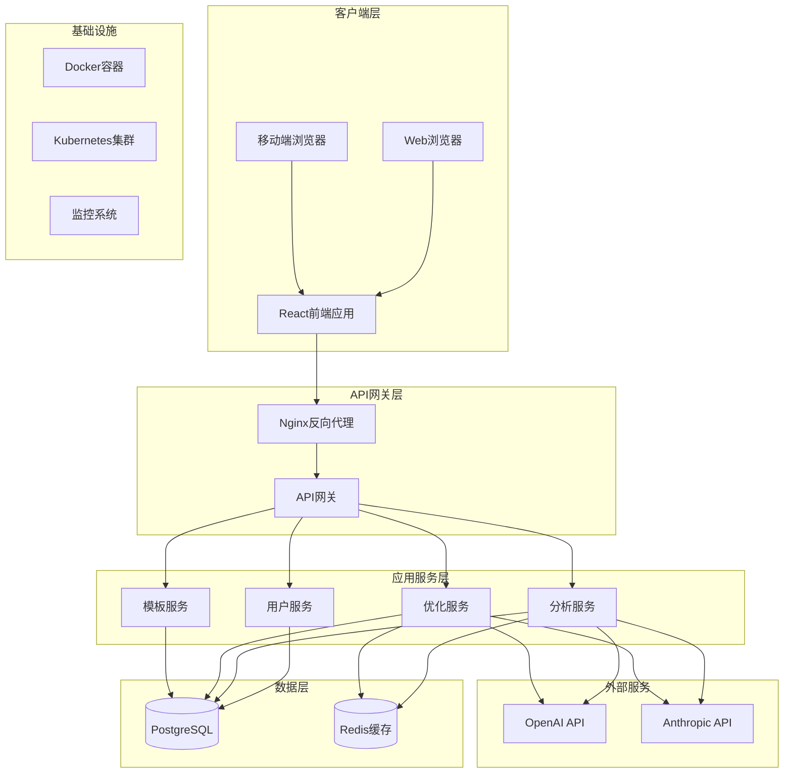
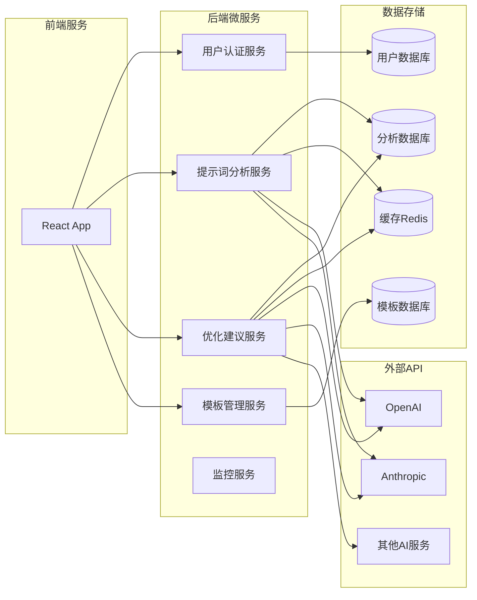
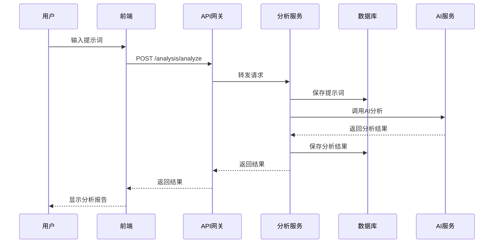
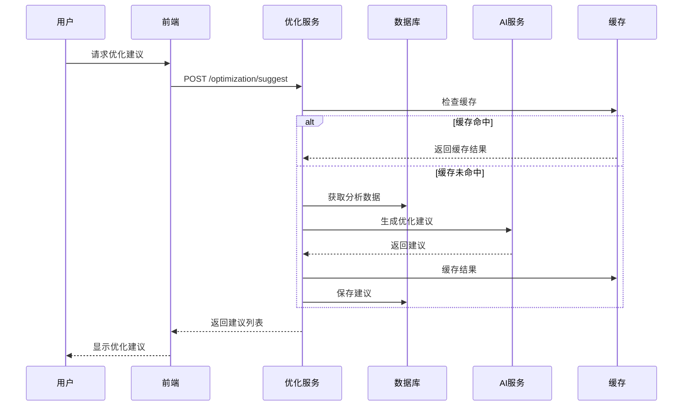

# Enhance Prompt Engineer - 设计文档

## 📋 文档信息
- **项目名称**: Enhance Prompt Engineer
- **文档版本**: v1.0
- **创建日期**: 2025-08-05
- **负责人**: AI开发团队负责人
- **审核状态**: 待审核

## 🏗 系统架构设计

### 整体架构概览
系统采用微服务架构，前后端分离设计，支持水平扩展和高可用部署。

### 架构层次
1. **表现层** - React前端应用
2. **API网关层** - 统一API入口和路由
3. **业务逻辑层** - FastAPI微服务
4. **数据访问层** - ORM和数据库连接
5. **数据存储层** - PostgreSQL + Redis
6. **外部服务层** - AI模型API集成

## 🔄 系统架构图

### 高层架构图


### 微服务架构图


## 📊 数据库设计

### 数据库架构
- **主数据库**: PostgreSQL 13+ (ACID事务支持)
- **缓存数据库**: Redis 6+ (高性能缓存)
- **搜索引擎**: Elasticsearch (可选，用于全文搜索)

### 核心数据表设计

#### 用户相关表
```sql
-- 用户表
CREATE TABLE users (
    id UUID PRIMARY KEY DEFAULT gen_random_uuid(),
    username VARCHAR(50) UNIQUE NOT NULL,
    email VARCHAR(100) UNIQUE NOT NULL,
    password_hash VARCHAR(255) NOT NULL,
    role VARCHAR(20) DEFAULT 'user',
    created_at TIMESTAMP DEFAULT CURRENT_TIMESTAMP,
    updated_at TIMESTAMP DEFAULT CURRENT_TIMESTAMP,
    is_active BOOLEAN DEFAULT true
);

-- 用户配置表
CREATE TABLE user_preferences (
    id UUID PRIMARY KEY DEFAULT gen_random_uuid(),
    user_id UUID REFERENCES users(id) ON DELETE CASCADE,
    preferred_ai_model VARCHAR(50) DEFAULT 'gpt-3.5-turbo',
    analysis_depth VARCHAR(20) DEFAULT 'standard',
    notification_settings JSONB DEFAULT '{}',
    created_at TIMESTAMP DEFAULT CURRENT_TIMESTAMP,
    updated_at TIMESTAMP DEFAULT CURRENT_TIMESTAMP
);
```

#### 提示词相关表
```sql
-- 提示词表
CREATE TABLE prompts (
    id UUID PRIMARY KEY DEFAULT gen_random_uuid(),
    user_id UUID REFERENCES users(id) ON DELETE CASCADE,
    title VARCHAR(200),
    content TEXT NOT NULL,
    category VARCHAR(50),
    tags TEXT[],
    is_template BOOLEAN DEFAULT false,
    is_public BOOLEAN DEFAULT false,
    created_at TIMESTAMP DEFAULT CURRENT_TIMESTAMP,
    updated_at TIMESTAMP DEFAULT CURRENT_TIMESTAMP
);

-- 分析结果表
CREATE TABLE analysis_results (
    id UUID PRIMARY KEY DEFAULT gen_random_uuid(),
    prompt_id UUID REFERENCES prompts(id) ON DELETE CASCADE,
    overall_score INTEGER CHECK (overall_score >= 0 AND overall_score <= 100),
    semantic_clarity INTEGER CHECK (semantic_clarity >= 0 AND semantic_clarity <= 100),
    structural_integrity INTEGER CHECK (structural_integrity >= 0 AND structural_integrity <= 100),
    logical_coherence INTEGER CHECK (logical_coherence >= 0 AND logical_coherence <= 100),
    analysis_details JSONB,
    processing_time_ms INTEGER,
    ai_model_used VARCHAR(50),
    created_at TIMESTAMP DEFAULT CURRENT_TIMESTAMP
);
```

#### 优化建议表
```sql
-- 优化建议表
CREATE TABLE optimization_suggestions (
    id UUID PRIMARY KEY DEFAULT gen_random_uuid(),
    analysis_id UUID REFERENCES analysis_results(id) ON DELETE CASCADE,
    suggestion_type VARCHAR(50) NOT NULL,
    priority INTEGER CHECK (priority >= 1 AND priority <= 5),
    description TEXT NOT NULL,
    improvement_plan TEXT,
    expected_impact VARCHAR(20),
    is_applied BOOLEAN DEFAULT false,
    created_at TIMESTAMP DEFAULT CURRENT_TIMESTAMP
);

-- 模板表
CREATE TABLE templates (
    id UUID PRIMARY KEY DEFAULT gen_random_uuid(),
    creator_id UUID REFERENCES users(id) ON DELETE SET NULL,
    name VARCHAR(200) NOT NULL,
    description TEXT,
    content TEXT NOT NULL,
    category VARCHAR(50),
    tags TEXT[],
    usage_count INTEGER DEFAULT 0,
    rating DECIMAL(3,2) DEFAULT 0.00,
    is_featured BOOLEAN DEFAULT false,
    created_at TIMESTAMP DEFAULT CURRENT_TIMESTAMP,
    updated_at TIMESTAMP DEFAULT CURRENT_TIMESTAMP
);
```

## 🔌 API接口设计

### RESTful API规范
- **基础URL**: `https://api.enhanceprompt.com/v1`
- **认证方式**: JWT Bearer Token
- **数据格式**: JSON
- **HTTP状态码**: 标准RESTful状态码

### 核心API端点

#### 用户认证API
```yaml
# 用户注册
POST /auth/register
Content-Type: application/json
{
  "username": "string",
  "email": "string", 
  "password": "string"
}

# 用户登录
POST /auth/login
Content-Type: application/json
{
  "email": "string",
  "password": "string"
}

# 刷新Token
POST /auth/refresh
Authorization: Bearer <refresh_token>
```

#### 提示词分析API
```yaml
# 分析提示词
POST /analysis/analyze
Authorization: Bearer <access_token>
Content-Type: application/json
{
  "content": "string",
  "options": {
    "depth": "standard|deep",
    "ai_model": "gpt-3.5-turbo|gpt-4|claude-3"
  }
}

# 获取分析结果
GET /analysis/{analysis_id}
Authorization: Bearer <access_token>

# 获取用户分析历史
GET /analysis/history?page=1&limit=20
Authorization: Bearer <access_token>
```

#### 优化建议API
```yaml
# 获取优化建议
POST /optimization/suggest
Authorization: Bearer <access_token>
Content-Type: application/json
{
  "analysis_id": "uuid",
  "preferences": {
    "scenario": "creative|technical|analytical",
    "target_model": "string"
  }
}

# 应用优化建议
POST /optimization/apply
Authorization: Bearer <access_token>
Content-Type: application/json
{
  "suggestion_id": "uuid",
  "prompt_id": "uuid"
}
```

#### 模板管理API
```yaml
# 创建模板
POST /templates
Authorization: Bearer <access_token>
Content-Type: application/json
{
  "name": "string",
  "description": "string",
  "content": "string",
  "category": "string",
  "tags": ["string"]
}

# 获取模板列表
GET /templates?category=string&tags=string&page=1&limit=20
Authorization: Bearer <access_token>

# 使用模板
POST /templates/{template_id}/use
Authorization: Bearer <access_token>
```

## 🎨 用户界面设计

### 设计原则
- **简洁直观**: 界面简洁，操作直观
- **响应式**: 适配各种屏幕尺寸
- **一致性**: 保持设计语言一致
- **可访问性**: 支持无障碍访问

### 主要页面设计

#### 1. 首页/仪表板
- **布局**: 左侧导航 + 主内容区
- **组件**: 
  - 快速分析入口
  - 最近分析历史
  - 性能统计图表
  - 推荐模板

#### 2. 提示词分析页面
- **布局**: 上下分栏
- **组件**:
  - 提示词输入区域
  - 分析选项配置
  - 实时分析结果展示
  - 详细报告下载

#### 3. 优化建议页面
- **布局**: 左右分栏
- **组件**:
  - 原始提示词显示
  - 建议列表
  - 优化后预览
  - 对比分析图表

#### 4. 模板库页面
- **布局**: 网格布局
- **组件**:
  - 搜索和筛选
  - 模板卡片
  - 分类导航
  - 收藏和评分

### UI组件库
- **基础组件**: Button, Input, Select, Modal等
- **业务组件**: PromptEditor, AnalysisChart, SuggestionCard等
- **布局组件**: Header, Sidebar, Footer, Container等

## 🔄 数据流设计

### 提示词分析流程


### 优化建议生成流程


## 🔒 安全设计

### 认证和授权
- **JWT Token**: 无状态认证
- **RBAC**: 基于角色的访问控制
- **API限流**: 防止API滥用
- **HTTPS**: 全站HTTPS加密

### 数据安全
- **数据加密**: 敏感数据加密存储
- **输入验证**: 严格的输入验证和过滤
- **SQL注入防护**: 使用参数化查询
- **XSS防护**: 输出编码和CSP策略

### 隐私保护
- **数据匿名化**: 分析数据匿名化处理
- **访问日志**: 完整的访问审计日志
- **数据备份**: 定期数据备份和恢复测试
- **GDPR合规**: 符合数据保护法规

## 📈 性能优化设计

### 缓存策略
- **Redis缓存**: 热点数据缓存
- **CDN**: 静态资源CDN加速
- **浏览器缓存**: 合理的缓存策略
- **数据库查询优化**: 索引优化和查询优化

### 扩展性设计
- **微服务架构**: 服务独立扩展
- **负载均衡**: 多实例负载均衡
- **数据库分片**: 支持数据库水平分片
- **异步处理**: 耗时任务异步处理

---

**文档状态**: ✅ 已完成  
**下一步**: 任务分解文档编写
